# Active Directory Help Desk Lab


## Overview

This project documents a hands-on Windows Server and Active Directory home lab built using VMware Workstation. The lab simulates a small corporate environment where I performed common Help Desk and IT administration tasks, including managing users, security groups, passwords, account status, DNS, Group Policy, and domain-joined computers.

## Lab Objectives

The objectives of this lab were to:

* [x] Deploy a Windows Server virtual machine
* [x] Configure a static IP address
* [x] Install Active Directory Domain Services (AD DS)
* [x] Configure a new Active Directory domain
* [x] Configure DNS services
* [x] Create Organizational Units (OUs)
* [x] Create and manage user accounts
* [x] Create security groups and assign users
* [x] Perform password resets
* [x] Disable and enable user accounts
* [x] Configure an account lockout policy
* [x] Unlock a locked user account
* [x] Deploy a Windows 11 client VM
* [x] Configure client DNS
* [x] Join a Windows client to the domain
* [x] Verify domain user authentication

## Network Diagram

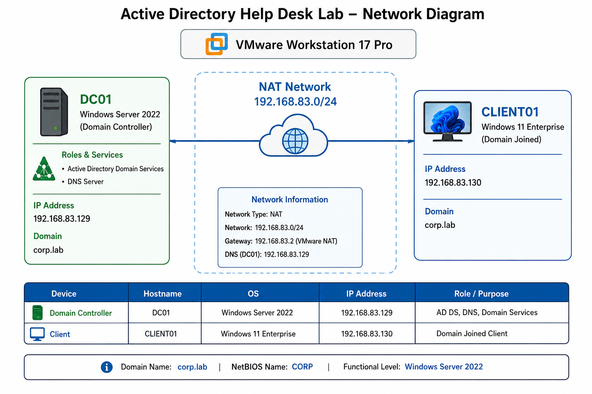

## Active Directory Structure

The following Organizational Unit structure was created:

```text
corp.lab
├── Employees
│   ├── IT
│   ├── HR
│   └── Finance
└── Groups
```

## User Accounts

Six fictional employee accounts were created and organized by department.

### IT Department

* John Smith (`jsmith`)
* Sarah Johnson (`sjohnson`)

### HR Department

* Michael Brown (`mbrown`)
* Emily Davis (`edavis`)

### Finance Department

* David Wilson (`dwilson`)
* Lisa Martinez (`lmartinez`)

## Security Groups

The following Global Security Groups were created:

* `IT-Support`
* `HR-Staff`
* `Finance-Staff`

Users were assigned to their corresponding department security groups.

## Help Desk Tasks Performed

### Password Reset

Simulated a Help Desk ticket where a user forgot their password. The user's password was reset through Active Directory Users and Computers, and the account was configured to require a password change at the next login.

### Account Disable and Enable

Simulated an employee taking extended leave. The user's Active Directory account was temporarily disabled and later re-enabled.

### Account Lockout and Unlock

Configured an Account Lockout Policy using Group Policy Management. A user account was locked after multiple failed login attempts and then unlocked through Active Directory Users and Computers.

### DNS Configuration and Troubleshooting

Configured the Windows 11 client to use the Domain Controller as its preferred DNS server. Initially, DNS requests failed because the Domain Controller VM was powered off. After starting the server, DNS resolution for `corp.lab` was successfully verified.

### Domain Join

Configured the Windows 11 client to use the Domain Controller for DNS and successfully joined `CLIENT01` to the `corp.lab` domain.

### Domain User Authentication

## 📸 Lab Screenshots

> ### ⬇️ CLICK BELOW TO EXPAND AND VIEW ALL LAB SCREENSHOTS ⬇️

<details>
<summary><h3>📸 Click here to view all screenshots </h3></summary>

<br>

### 🖥️ Server Renamed

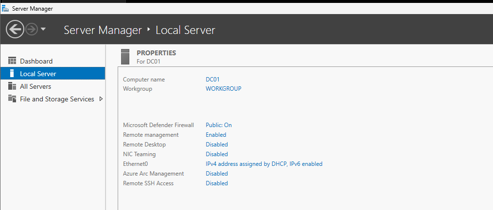

### 🌐 Static IP Configuration

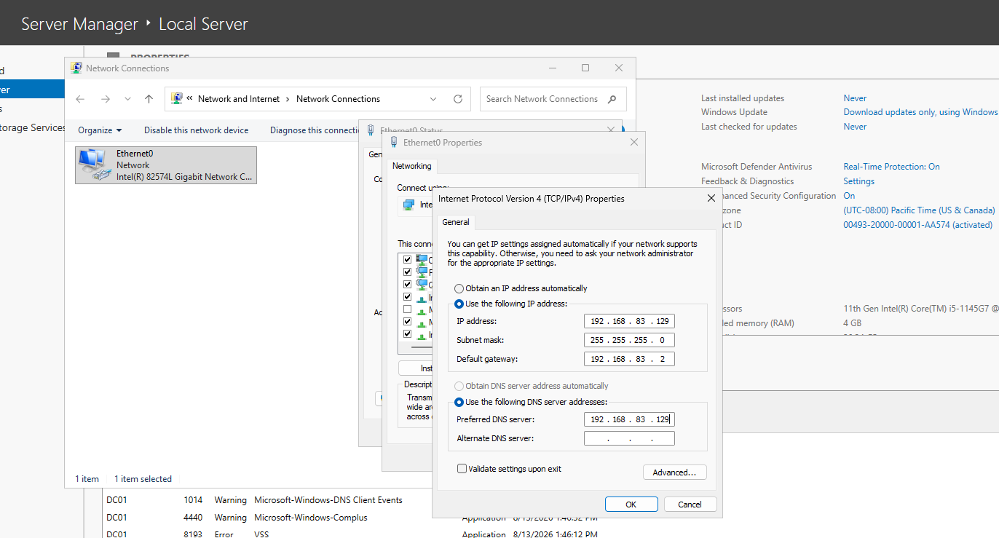

### ⚙️ AD DS Installed

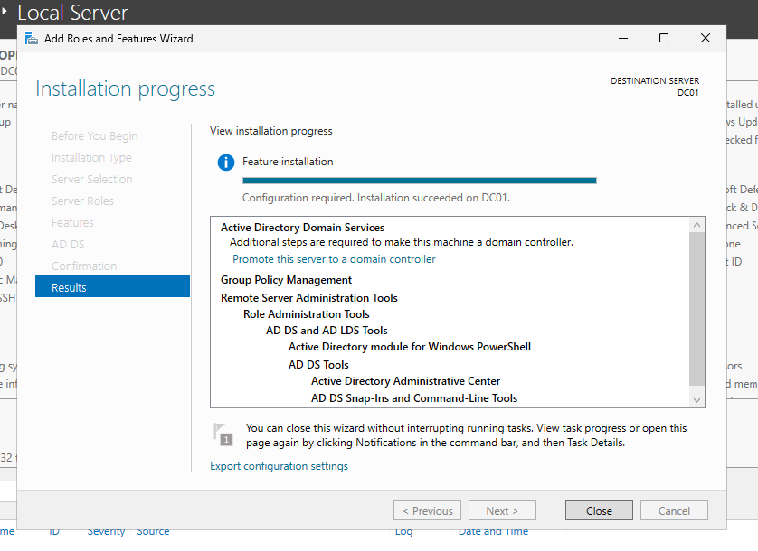

### 🏢 Domain Controller

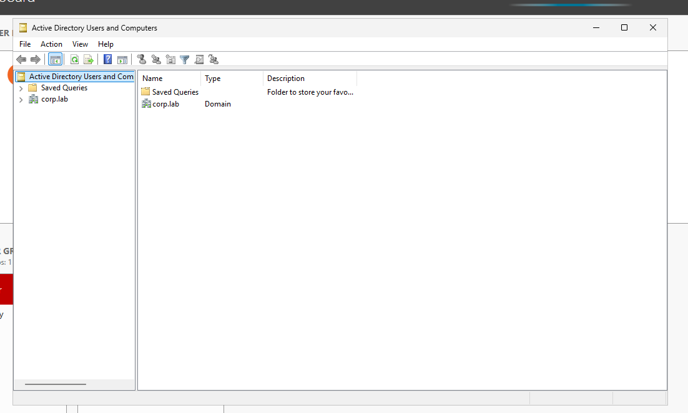

### 🗂️ Organizational Units

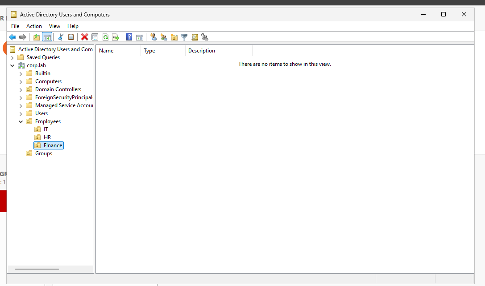

### 👥 Active Directory Users

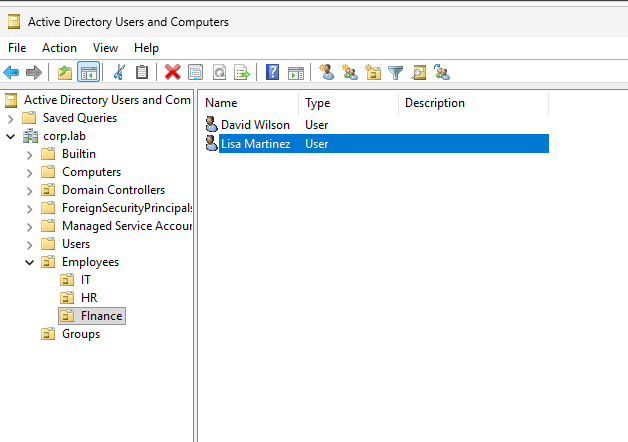

### 🔐 Security Group Membership

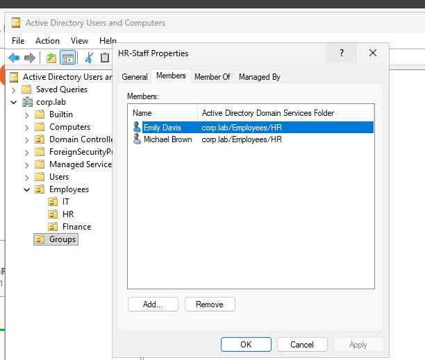

### 🔑 Password Reset

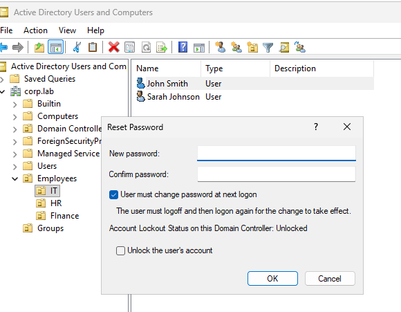

### 💻 Client Joined to Domain

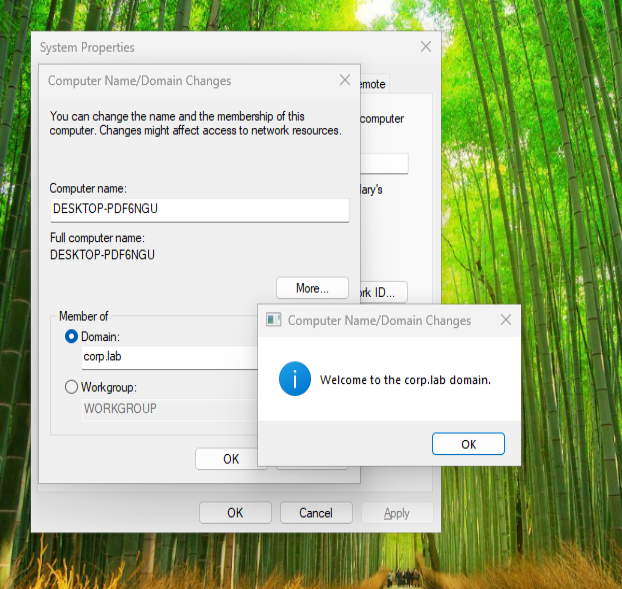

### 🔒 Account Lockout Policy

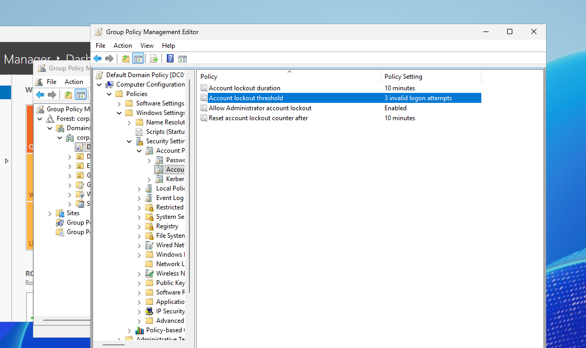

### 🔓 Account Unlock

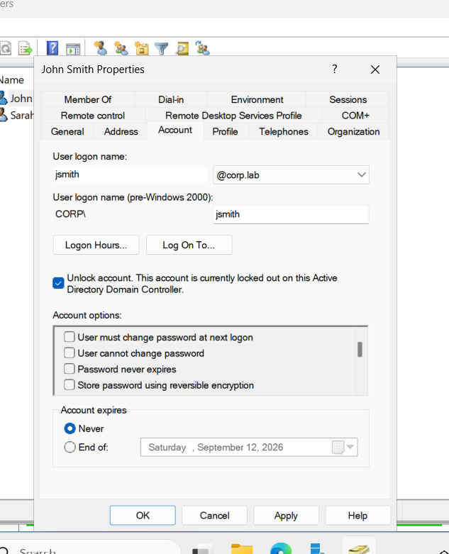

</details>

## Skills Demonstrated

* Windows Server Administration
* Active Directory Administration
* Active Directory Domain Services (AD DS)
* DNS Configuration and Troubleshooting
* User Account Management
* Security Group Management
* Password Reset and Account Recovery
* Account Enable/Disable Management
* Group Policy Management
* Account Lockout Troubleshooting
* Windows Domain Joining
* Domain User Authentication
* Basic Network Troubleshooting
* VMware Virtualization

## Key Takeaways

This lab provided hands-on experience managing a Windows Server Active Directory environment and performing common Help Desk administration tasks. I gained practical experience configuring a Domain Controller, managing users and groups, troubleshooting DNS connectivity, applying account security policies, joining Windows clients to a domain, and authenticating users within a domain environment.
